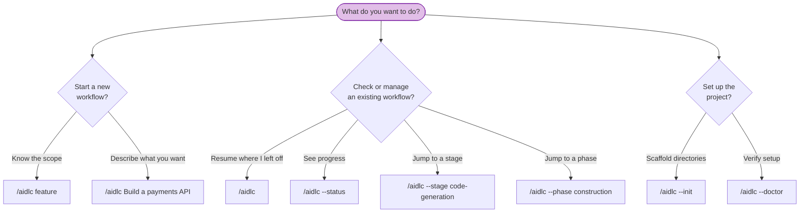

# CLI Commands

All AI-DLC commands start with the orchestrator invocation. This chapter is a complete reference for every invocation pattern and flag.

> **Invocation prefix differs by harness.** On Claude Code and Kiro CLI you type
> `/aidlc`; on Codex CLI it is `$aidlc` (or `/skills` → aidlc). The flags and
> behaviour below are identical either way — only the prefix changes. The examples
> use `/aidlc`; substitute `$aidlc` on Codex. See [Running on Codex CLI](harnesses/codex-cli.md).

---

## Quick Reference

| Command | Description |
|---------|-------------|
| `/aidlc [scope]` | Start a new workflow with an explicit scope |
| `/aidlc [description]` | Start a new workflow; scope is auto-detected from your description |
| `/aidlc` | Resume an existing workflow (if state file exists) or start new |
| `/aidlc --init` | Scaffold the `aidlc-docs/` directory without starting a workflow |
| `/aidlc --status` | Display a read-only status summary |
| `/aidlc --doctor` | Run a health check on your setup |
| `/aidlc --stage <slug\|#>` | Jump to a specific stage |
| `/aidlc --stage <slug> --single` | Run one stage in isolation, without advancing your workflow |
| `/aidlc --phase <name\|#>` | Jump to the start of a phase |
| `/aidlc --scope <name>` | Change the active scope |
| `/aidlc --depth <level>` | Override depth level (minimal, standard, comprehensive) |
| `/aidlc --test-strategy <level>` | Override test strategy (minimal, standard, comprehensive) |
| `/aidlc --test-run` | Enable automated mode (auto-approve all gates) |
| `/aidlc --version` | Print the framework version |
| `/aidlc --help` | Display usage information |

---

## Command Decision Tree



<!-- Text fallback: Starting a new workflow: use /aidlc feature (known scope) or /aidlc Build a payments API (auto-detect). Managing an existing workflow: /aidlc (resume), /aidlc --status (view progress), /aidlc --stage (jump to stage), /aidlc --phase (jump to phase). Setup: /aidlc --init (scaffold), /aidlc --doctor (health check). -->

---

## Detailed Reference

### `/aidlc [scope]` — Start with explicit scope

Start a new workflow with one of the 9 named scopes.

**Syntax:**

```
/aidlc enterprise
/aidlc feature
/aidlc mvp
/aidlc poc
/aidlc bugfix
/aidlc refactor
/aidlc infra
/aidlc security-patch
```

**Behavior:** The framework recognizes the scope keyword, asks what you want to build, then runs the Initialization phase and begins the first domain stage. If a state file already exists, it offers resume options instead.

**Example:**

```
/aidlc bugfix
> What would you like to fix?
> The login API returns 500 when email contains a plus sign
```

---

### `/aidlc [description]` — Start with auto-detection

Describe what you want to build and the engine auto-detects the appropriate scope.

**Syntax:**

```
/aidlc Build a REST API for inventory management
/aidlc Fix the login timeout bug
```

**Behavior:** The engine analyzes keywords in your description (e.g., "fix" suggests bugfix, "build" suggests feature) and proposes a scope. You confirm or override before the workflow begins.

**Example:**

```
/aidlc Fix the null pointer in ProfileSerializer
> Detected scope: bugfix (Minimal depth, Minimal test strategy, 8 stages)
> Approve scope? [Yes / Change scope / Change depth / Change test strategy]
```

---

### `/aidlc` — Resume existing workflow

Run with no arguments when a state file exists to resume.

**Syntax:**

```
/aidlc
```

**Behavior:** Reads `aidlc-state.md`, checks `.aidlc-recovery.md` for corruption, then presents four resume options: resume from checkpoint, redo current stage, jump to stage, or start fresh. See [Session Management](10-session-management.md) for details.

If no state file exists, the framework treats this as a new workflow and asks for scope/description.

---

### `/aidlc --init` — Scaffold directories

Create the `aidlc-docs/` directory tree without starting a workflow.

**Syntax:**

```
/aidlc --init [--scope <scope>] [--depth <level>] [--test-strategy <level>] [--force]
```

**Behavior:** Runs the three Initialization stages (Workspace Scaffold, Workspace Detection, State Init) as a single deterministic tool call. Scaffolds the full directory tree with knowledge directories and README files, runs a rule-based workspace scan, and writes `aidlc-state.md` with the scope plan. Logs the init-sequence events (`WORKFLOW_STARTED`, `WORKSPACE_SCAFFOLDED`, `WORKSPACE_SCANNED`, `WORKSPACE_INITIALISED`, plus per-stage `STAGE_STARTED`/`STAGE_COMPLETED`). Does not start any domain stages. `--scope` defaults to `poc` when omitted; `--force` rewrites an existing `aidlc-state.md` and re-emits the init events into the existing `audit.md`.

The welcome message is rendered at session start via the `companyAnnouncements` entry in `settings.json` — it is not part of `--init`.

**Use case:** Prepare the project for team knowledge files and guardrails before starting the first workflow, or reset state after a failed workflow with `--force`.

---

### `/aidlc --status` — Read-only status

Display current workflow progress without modifying anything.

**Syntax:**

```
/aidlc --status
```

**Behavior:** Reads `aidlc-state.md` and displays: current phase, current stage, completed/total stage count, scope, depth, and the stage progress list. If no workflow is active, reports that no workflow is in progress.

---

### `/aidlc --doctor` — Health check

Validate that all of this implementation's prerequisites, configuration, and stage-graph integrity are in place. Exits 0 on full pass, 1 on any failure; the full report writes to stdout in both cases so the orchestrator surfaces it either way. `--doctor` is **read-only** — on a pristine project (no `aidlc-docs/audit.md`) it creates no files, so it is safe to run before `--init`; on an initialized project it records a `HEALTH_CHECKED` audit row.

**Syntax:**

```
/aidlc --doctor
```

**What it checks:**

| Check | What it validates |
|-------|-------------------|
| Prerequisites | `bun` is installed and on PATH |
| Hook presence | Every hook `settings.json` wires (its `hooks` blocks + the `statusLine` command — all 10 framework hooks) exists in `.claude/hooks/`; a wired-but-missing hook fails loudly. Sourcing the expected roster from `settings.json` means adding a hook there auto-checks it |
| Project structure | `.claude/settings.json` exists (file presence only, no content validation) |
| Docs scaffold | `aidlc-docs/` directory is present (run `/aidlc --init` if missing) |
| Env scope | `AWS_AIDLC_DEFAULT_SCOPE` (if set) names a valid scope |
| Hook heartbeats | `.aidlc-hooks-health/` contains recent timestamps from hook executions |
| State drift | `aidlc-state.md` matches the last `WORKFLOW_COMPLETED` in the audit |
| Cycle detection | `stage-graph.json` has no cycles |
| Orphan stage files | Every slug in the graph has a matching `<phase>/<slug>.md` on disk |
| Scope validation | All 9 scopes (from `.claude/scopes/*.md`) walk cleanly (advisories for scope-truncation gaps are expected) |
| Schema validation | Every stage's YAML frontmatter passes `validateStageFrontmatter` |
| Graph references | Every `consumes[].artifact` and `requires_stage[]` target resolves |
| Keyword overlap | No keyword is claimed by >1 scope |
| Rule drift | Surfaces any team or project rule heading that overlaps a populated org-policy heading, so you can review it for contradiction (advisory — never fails) |
| Paired sensor coverage | Confirms every rule that names a paired Sensor resolves to a Sensor some stage actually fires (advisory — never fails) |

**Example output:**

```
✓ bun installed (required for CLI tools and hooks)
✓ aidlc-audit-logger.ts present
✓ aidlc-sync-statusline.ts present
✓ aidlc-validate-state.ts present
✓ aidlc-log-subagent.ts present
✓ aidlc-session-start.ts present
✓ aidlc-session-end.ts present
✓ aidlc-statusline.ts present
✓ settings.json present
✓ AWS_AIDLC_DEFAULT_SCOPE (unset — no project default)
✓ aidlc-docs/ directory exists
✓ Hook heartbeats: not yet fired (first workflow stage will populate)
✓ State matches last audit event (no drift)
✓ Cycle detection: 0 cycles
✓ Orphan stage files: 32 graph entries all have files
✓ Scope validation: 9 scopes valid (29 advisories)
✓ Schema validation: 32/32 stages valid
✓ Graph references: 122 artifacts + edges resolved
✓ Keyword overlap: no conflicts
✓ Rule drift: no team/project rule overlaps org policy
✓ Paired sensor coverage: no sensor-bound rules (0 feedforward-only)
```

---

### `/aidlc --stage <slug|#>` — Jump to stage

Jump directly to a specific stage by slug or number.

**Syntax:**

```
/aidlc --stage code-generation
/aidlc --stage 3.5
/aidlc --stage requirements-analysis
/aidlc --stage 2.3
```

**Behavior:** If a workflow is active, jumps to the target stage (skipping intervening stages with warnings). If no workflow exists, you can combine with `--scope`:

```
/aidlc --stage code-generation --scope bugfix
```

---

### `/aidlc --stage <slug> --single` — Run one stage in isolation

Add `--single` to run a single stage on its own without touching your main
workflow. The stage runs, writes its artifact, and stops; your workflow's
`Current Stage` is never advanced — the isolation is enforced by the engine, not
by convention. Use it to apply one piece of methodology (a requirements
analysis, a reverse-engineering scan) without committing to a full lifecycle.

```
/aidlc --stage requirements-analysis --single
/aidlc --stage reverse-engineering --single
```

Every runnable stage also ships a typeable one-word runner — `/aidlc-<slug>`,
which packages `/aidlc --stage <slug> --single`. The full runner family (scope
runners, stage runners, `/aidlc-init`, and the session views) is documented in
[Skills and Runner Commands](17-skills.md).

---

### `/aidlc --phase <name|#>` — Jump to phase

Jump to the first stage of a specific phase.

**Syntax:**

```
/aidlc --phase construction
/aidlc --phase 3
/aidlc --phase ideation
/aidlc --phase 1
```

**Behavior:** Same as `--stage` but targets the first stage of the named phase. Can be combined with `--scope`.

---

### `/aidlc --scope <name>` — Change scope

Change the active scope of a running workflow.

**Syntax:**

```
/aidlc --scope bugfix
/aidlc --scope enterprise
```

**Behavior:** Updates the scope configuration in `aidlc-state.md`, recalculates which stages should execute and which should be skipped, and logs a `SCOPE_CHANGED` audit event. Can be combined with `--depth` to override the new scope's default depth.

On a fresh project with no workflow yet, `--scope <name>` starts one instead: it behaves exactly like `/aidlc <name>` — the workspace is initialized with the named scope and the workflow begins at its first stage.

---

### `/aidlc --depth <level>` — Override depth

Override the depth level of the current or new workflow.

**Syntax:**

```
/aidlc --depth minimal
/aidlc --depth standard
/aidlc --depth comprehensive
```

**Behavior:** When a workflow is active, updates the Depth field in `aidlc-state.md` and logs a `DEPTH_CHANGED` audit event. When combined with `--scope`, overrides the new scope's default depth. When combined with `--stage` or `--phase`, sets the depth for the jump target's execution context. Without an active workflow, produces an error.

**Valid values:** `minimal`, `standard`, `comprehensive` (case-insensitive).

**Examples:**

```
/aidlc --depth minimal                            Change depth of active workflow
/aidlc --scope bugfix --depth comprehensive        Bugfix with comprehensive analysis
/aidlc --stage code-generation --depth minimal     Jump with minimal depth
```

---

### `/aidlc --test-strategy <level>` — Override test strategy

Override the test volume strategy independently of depth.

**Syntax:**

```
/aidlc --test-strategy minimal
/aidlc --test-strategy standard
/aidlc --test-strategy comprehensive
```

**Behavior:** Defaults to the current depth level when not specified, unless the scope declares its own default (e.g., workshop defaults to Minimal). When set independently, allows combinations like Standard depth (full artifacts) with Minimal testing (Nyquist model). Updates the `Test Strategy` field in `aidlc-state.md` and logs a `TEST_STRATEGY_CHANGED` audit event.

**Valid values:** `minimal`, `standard`, `comprehensive` (case-insensitive).

**Test strategy models:**
- **Minimal (Nyquist):** 1 test per requirement, happy-path floor, unit tests only (~5-15 total)
- **Standard:** 5-8 tests per component, unit + integration
- **Comprehensive:** 10-15 tests per component, all test types

See [Scopes, Depth, and Test Strategy](04-scopes-and-depth.md#the-3-test-strategy-levels) for full details on each level, defaulting behavior, and common combinations.

**Examples:**

```
/aidlc --test-strategy minimal                         Minimal testing for active workflow
/aidlc --depth standard --test-strategy minimal        Full artifacts, minimal tests
/aidlc --scope bugfix --test-strategy comprehensive    Bugfix with thorough testing
```

---

### `/aidlc --test-run` — Automated mode

Enable automated mode for CI and testing environments.

**Syntax:**

```
/aidlc bugfix --test-run
```

**Behavior:** Auto-approves all approval gates, auto-answers all questions, and auto-selects options without user interaction. State tracking, audit logging, and artifact generation all continue normally. Intended for automated testing only, not interactive use.

---

### `/aidlc --version` — Framework version

Print the framework version (`aidlc <X.Y.Z>`) and exit. Read-only — works without a workflow and never prompts to resume one.

**Syntax:**

```
/aidlc --version
```

---

### `/aidlc --help` — Usage information

Display a summary of available commands and flags.

**Syntax:**

```
/aidlc --help
```

---

## Deterministic CLI Tools

Beyond the `/aidlc` flags above, this implementation ships three Bun/TypeScript tools that the hooks call automatically as a workflow runs. You rarely invoke them by hand — they keep the audit trail, the Sensor results, and the runtime graph in sync without you asking. They are documented here because they surface in `--doctor` output and in `audit.md`, and because each one is a useful debug handle when you want to see what the framework saw.

Run any of them with `bun .claude/tools/<tool>.ts <subcommand>`.

### `aidlc-sensor` — inspect and fire Sensors

Sensors are deterministic checks that run after every `Write` or `Edit` to a stage output (see [Rules and the Learning Loop](08-rules-and-the-learning-loop.md) and reference [Sensor System](../reference/07-sensor-system.md)). The PostToolUse hook fires them for you; this tool lets you list, describe, and manually fire one.

| Subcommand | What it does |
|------------|--------------|
| `list` | Print every framework Sensor (`id`, `kind`, `description`), alphabetically |
| `describe <id>` | Print one Sensor's full manifest (command, default severity, `matches` glob, timeout) |
| `fire <id> --stage <slug> --output-path <path>` | Run a Sensor against a file and emit a `SENSOR_FIRED` row plus its paired result row |

A manual fire emits a `SENSOR_FIRED` audit row, then exactly one terminal row: `SENSOR_PASSED`, `SENSOR_FAILED`, or `SENSOR_BUDGET_OVERRIDE`. A failure writes a detail file under `aidlc-docs/.aidlc-sensors/<stage>/`. Sensors are advisory — a Sensor failure is never a tool failure, so the command still exits 0. The four Sensors that ship with the framework are `required-sections`, `upstream-coverage`, `linter`, and `type-check`.

```
bun .claude/tools/aidlc-sensor.ts list
bun .claude/tools/aidlc-sensor.ts describe required-sections
bun .claude/tools/aidlc-sensor.ts fire required-sections \
  --stage requirements-analysis \
  --output-path aidlc-docs/inception/requirements-analysis/requirements.md
```

### `aidlc-learnings` — the learning-gate tool

This is the deterministic half of the §13 learning gate. After a stage is approved, the orchestrator uses it to turn your stage's `memory.md` diary into reviewable learning candidates, then to persist the ones you confirm. You normally never call it directly — the orchestrator drives both steps around an `AskUserQuestion` gate — but it is here so the audit rows it emits make sense.

| Subcommand | What it does |
|------------|--------------|
| `surface --slug <stage-slug>` | Read the just-approved stage's `memory.md` and print structured candidates (Interpretations, Deviations, Tradeoffs) plus any parked open questions. Read-only |
| `persist --slug <stage-slug> --selections-json <path>` | Write the confirmed learnings to `aidlc-project-learnings.md` / `aidlc-team-learnings.md` (and, for a Sensor-binding learning, scaffold and bind a project-tier Sensor), emitting `RULE_LEARNED` / `SENSOR_PROPOSED` |

Both steps are skipped under `--test-run`. Confirmed learnings apply on the next workflow, not the current one.

### `aidlc-runtime` — read the runtime graph

The runtime graph (`aidlc-docs/runtime-graph.json`) is the data-plane record of what actually happened this workflow: which stages ran, how full each `memory.md` diary got, which Sensors fired, what each returned. It is the runtime mirror of the structural `stage-graph.json`. The framework recompiles it after every stage transition; this tool lets you trigger a compile or read one stage's row.

| Subcommand | What it does |
|------------|--------------|
| `compile` | Walk `audit.md` and the per-stage `memory.md` files and rewrite `runtime-graph.json`. Fired automatically by a hook on every transition |
| `read <stage-slug>` | Print one stage's row from `runtime-graph.json` (timestamps, agent, memory breakdown, Sensor firings, outcome) |
| `summary [--json]` | Print deterministic aggregates over the whole graph — stage/phase outcome tallies, memory-entry counts, Sensor 4-state tallies, learnings captured, workflow duration. The data source the read-only session skills read from |

```
bun .claude/tools/aidlc-runtime.ts read requirements-analysis
```

`runtime-graph.json` is gitignored. See [Artifacts Reference](13-artifacts-reference.md) for the artifact's shape and the [Runtime Graph](../reference/13-runtime-graph.md) reference chapter for the full schema.

### Session skills — report on a workflow

Three read-only skills surface what `aidlc-runtime summary` reports, wrapped in readable output. Type them like commands:

| Skill | What it does |
|-------|--------------|
| `/aidlc-session-cost` | Deterministic cost view (duration, stage outcomes, memory, Sensors, learnings). Terminal only |
| `/aidlc-replay` | Readable session narrative for async review. Terminal only |
| `/aidlc-outcomes-pack` | Handover document for the team. Writes `OUTCOMES.md` |

All three are read-only — no stage advance, no audit emit — and source every number from `aidlc-runtime summary --json`. See [Session Management § Session Skills](10-session-management.md#session-skills) for the full walkthrough.

---

## Environment Variables

### `AWS_AIDLC_DEFAULT_SCOPE`

Pre-set the default scope for a project. Read from `.claude/settings.json` `env` block at workflow initialization.

**Syntax (in `.claude/settings.json`):**

```json
{
  "env": {
    "AWS_AIDLC_DEFAULT_SCOPE": "workshop"
  }
}
```

**Valid values:** `enterprise`, `feature`, `mvp`, `poc`, `bugfix`, `refactor`, `infra`, `security-patch`, `workshop`.

**Precedence:** explicit CLI flag > keyword detection > `AWS_AIDLC_DEFAULT_SCOPE` > hard-coded fallback.

**Scope of effect:** applies at workflow initialization only. Once `aidlc-docs/aidlc-state.md` exists, the state file is authoritative. See [Customization § Per-Project Default Scope](12-customization.md#per-project-default-scope) for the full walkthrough.

---

## Next Steps

- [Skills and Runner Commands](17-skills.md) — The typeable `/aidlc-<scope>` and `/aidlc-<stage>` runners, and what `--single` does
- [Session Management](10-session-management.md) — Resume options and stage jumps in detail
- [Scopes, Depth, and Test Strategy](04-scopes-and-depth.md) — Scope definitions, stage mappings, and test strategy levels
- [Troubleshooting](15-troubleshooting.md) — When commands don't behave as expected
- [Glossary](glossary.md) — Definitions for command, utility command, scope
